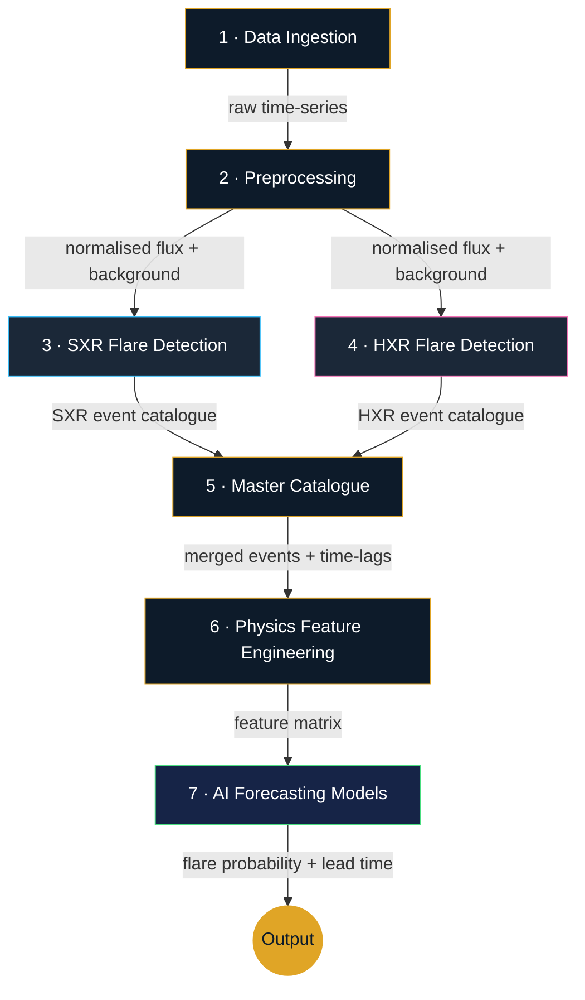

# Aditya-L1 Solar Flare Detection & Forecasting Pipeline

Prototype for **Bharatiya Antariksh Hackathon 2026 (H2S)** — *Forecasting and/or
Nowcasting of Solar Flares using combined Soft and Hard X-ray data from Aditya-L1*.

## What's in this folder

| File | Purpose |
|---|---|
| `pipeline.py` | Full detection + forecasting pipeline (this is the core deliverable) |
| `dashboard.html` | Combined browser dashboard — Live Monitor, Pipeline Flow, and Flare Occurrence (3 tabbed sections) |
| `requirements.txt` | Python dependencies |
| `convert_fits.py` | Converts real ISSDC FITS files → JSON for both this pipeline and the browser dashboard |

## Architecture

```
Aditya-L1 ─┬─ SoLEXS (soft X-ray) ─ preprocess ─ feature extract ─ SXR detector ─┐
           └─ HEL1OS (hard X-ray) ─ preprocess ─ feature extract ─ HXR detector ─┤
                                                                                  ▼
                                                              Master flare catalogue
                                                                                  │
                                          Physics-based feature engineering
                                  (Neupert effect, SXR–HXR lag, cross-correlation,
                                          shape features, rolling statistics)
                                                                                  │
                                              AI forecasting model (XGBoost / LSTM)
                                                                                  │
                                                  Flare probability + lead time
```

## Working Flow

The pipeline executes in **7 sequential stages**, each feeding into the next.
Below is the end-to-end data flow followed by a step-by-step breakdown.



### Step-by-step breakdown

| Step | Stage | What happens |
|------|-------|-------------|
| **1** | **Data Ingestion** | Loads input data — either synthetic Aditya-L1 telemetry (`--demo`) or real ISSDC FITS-converted JSON (`--data`). Produces raw time-series arrays for 3 SoLEXS and 4 HEL1OS energy channels. |
| **2** | **Preprocessing** | Computes a **rolling 10th-percentile background** for every channel so flares don't inflate the baseline. Outputs normalised flux ratios (`flux / background`) used by both detectors. |
| **3** | **SXR Detection** | Scans the SoLEXS 6–10 keV channel for intervals where the ratio exceeds `SXR_THRESHOLD × background` while the flux is still rising. Each flagged interval is segmented into start → peak → end, and the peak is classified (A/B/C/M/X) by magnitude. |
| **4** | **HXR Detection** | Runs `scipy.signal.find_peaks` on the HEL1OS 10–15 keV channel with a prominence threshold set relative to the quiet-time noise floor. Captures impulsive hard X-ray bursts that are too brief for the SXR threshold method. |
| **5** | **Master Catalogue** | Matches SXR and HXR events whose peaks fall within a ±400 s window. Records the **SXR–HXR time lag** — a physically meaningful feature (HXR typically leads SXR per the Neupert effect). |
| **6** | **Physics Feature Engineering** | For every catalogued event, extracts features **only from pre-peak data** (no future leakage): Neupert ratio, cross-correlation lag, rise/decay/FWHM shape features, rolling statistics (mean, std, skew, kurtosis, slope), and pre-flare SXR enhancement fraction. |
| **7** | **AI Forecasting** | Builds a **sliding-window labelled matrix** (label = 1 if a flare peaks within the next 30 min). Trains **XGBoost** and **LSTM** models on a **temporal train/test split** (no shuffle) to predict flare probability and lead time. |

### Data flow at a glance

```
 FITS / JSON ──► preprocess() ──┬──► detect_sxr() ──┐
                                │                    ├──► merge_catalogues()
                                └──► detect_hxr() ──┘          │
                                                    compute_event_features()
                                                                │
                                                    build_feature_matrix()
                                                         ┌──────┴──────┐
                                                   train_xgboost()  train_lstm()
                                                         │             │
                                                     Probability + Lead-time
```

## Quick start

```bash
pip install -r requirements.txt

# Run on synthetic data (no download needed) — detection + ML training
python pipeline.py --demo

# Detection only, skip ML training (faster)
python pipeline.py --demo --no-train

# Run on real ISSDC data (after converting FITS → JSON)
python pipeline.py --data ../aditya_l1_data.json
```

## What each stage does

**SXR detector** (`detect_sxr`) flags a flare when the SoLEXS 6–10 keV channel
exceeds `threshold × rolling background` while still rising. The rolling
background uses a 10th-percentile filter so it isn't dragged up by the flare
itself.

**HXR detector** (`detect_hxr`) uses `scipy.signal.find_peaks` with a
prominence threshold tuned to the quiet-time noise floor, since hard X-ray
bursts are impulsive spikes rather than gradual rises.

**Master catalogue** (`merge_catalogues`) matches SXR and HXR events within a
±400 s window and records the time lag between them — this lag is itself a
physically meaningful feature (HXR usually leads SXR per the Neupert effect).

**Physics features** (`compute_event_features`) computes, per event, only
from *pre-peak* data (so there's no lookahead leakage):
- **Neupert ratio** — correlation between d(SXR)/dt and HXR flux
- **SXR–HXR lag** — cross-correlation lag in seconds
- **Shape features** — rise time, decay time, FWHM, asymmetry
- **Rolling statistics** — mean, std, skew, kurtosis, slope for both channels
- **Pre-flare enhancement** — fractional SXR rise over the look-back window

**Forecasting models** (`train_xgboost`, `train_lstm`) are both trained on a
**sliding-window labelled matrix** (`build_feature_matrix` /
`build_lstm_sequences`): each window is labelled `1` if a flare peaks within
the next 30 minutes (`HORIZON_S`), and the **train/test split is temporal**
(not shuffled) to avoid leaking future information into training — this
mirrors how the model would actually be deployed.

## Tuning knobs

All at the top of `pipeline.py`:

```python
SXR_THRESHOLD  = 3.0   # nowcast sensitivity — lower catches weaker flares, more false alarms
HXR_MIN_PROM   = 4.0   # HXR peak prominence (× quiet-time noise)
LOOKBACK_S     = 900   # how much history feeds the forecast (15 min)
HORIZON_S      = 1800  # how far ahead the model predicts (30 min)
```

Raising `HORIZON_S` gives more lead time but a harder/noisier prediction
target; this is the same trade-off the evaluation criteria (lead time vs.
false alarm rate) is explicitly testing for.

## Validated demo results

Running `python pipeline.py --demo` against 6.5 hours of synthetic data with
5 planted flares (C/M/B/X/C classes, spaced ~70–100 min apart):

- **Detection**: all 5 flares correctly found and classified, including the
  weak B-class event
- **XGBoost forecasting**: AUC 0.999, Recall 0.96, Precision 0.96 on a
  temporally held-out test split
- Top predictive feature was `sxr_slope` (the rate of rise in soft X-ray),
  consistent with published pre-flare brightening literature

LSTM training (`train_lstm`) requires `pip install torch` — the function is
complete and shares the same data pipeline, but wasn't executed in this
sandbox due to disk constraints. Swap in `build_lstm_sequences()` →
`train_lstm()` once torch is available locally.

## Next steps for the real submission

1. Run `convert_fits.py --inspect` on your downloaded SoLEXS/HEL1OS files to
   confirm column names match what `pipeline.py` expects
2. Replace synthetic `known_flares` with GOES event-list timestamps so the
   ML models train on real ground truth
3. Tune `SXR_THRESHOLD` / `HXR_MIN_PROM` against a hand-labelled validation
   set from real Aditya-L1 data
4. Add a Transformer baseline alongside XGBoost/LSTM for the model
   comparison the hackathon brief calls for
